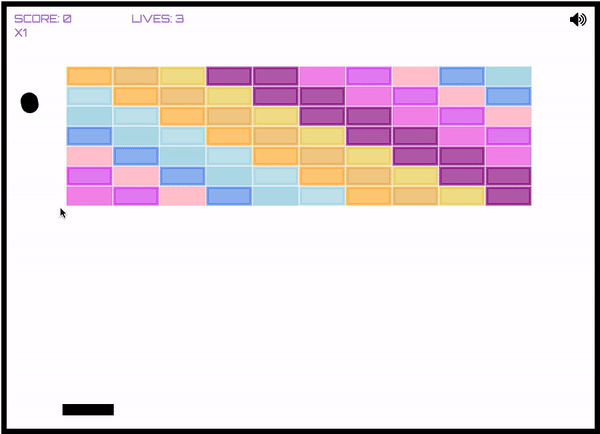
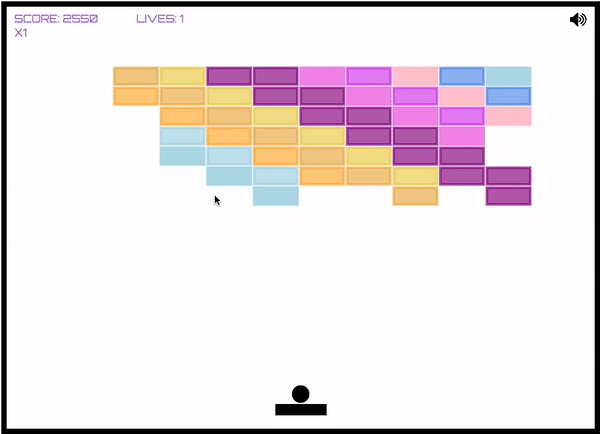
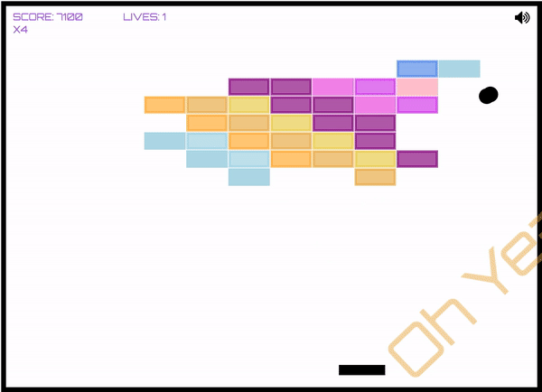

# Musical Breakout
## [JavaScript](https://www.javascript.com/) - [HTML](https://developer.mozilla.org/en-US/docs/Web/HTML) - [CSS](https://developer.mozilla.org/en-US/docs/Web/CSS) - [Canvas](https://developer.mozilla.org/en-US/docs/Web/API/Canvas_API) - [Logic Pro X](https://www.apple.com/logic-pro/)

Welcome to the `Musical Breakout` repo! This is my sonically pleasing version of the classic arcade game Breakout.

https://donaldbatryn.github.io/Musical_Breakout/

This game was made with the pure simplicity of HTML, CSS and JavaScript.

---------------------

### I used an HTML Canvas to animate the game. I designed and recorded custom music and audio samples that are integrated into gameplay, making every round a unique experience.




### Experimenting with `event listeners` and `keyframes`, I was able to match up audio samples with their textual representations and have them fly across the screen responsively.
---------------------

### I designed my own load-balancer using several `<audio>` tags. 

``` javascript
    collideWith(ctx) {
        this.game.remove(this);
        let player1 = document.getElementById("audio-1");
        let player2 = document.getElementById("audio-2");
        let player4 = document.getElementById("audio-4");
        let player5 = document.getElementById("audio-5");
        if (player1.duration > 0 && !player1.paused){
            if (player2.duration > 0 && !player2.paused){
                if (player5.duration > 0 && !player5.paused){
                    player4.setAttribute("src", this.sound);
                    player4.play();
                } else {
                    player5.setAttribute("src", this.sound);
                    player5.play();
                }
            } else {
                player2.setAttribute("src", this.sound);
                player2.play();
            }
        } else {
            player1.setAttribute("src", this.sound);
            player1.play();
        }
        this.breakAnimation(ctx);
        this.createFlyer(this);
        this.game.brickRotation += 1
    };
```
----------------

### Includes mute button for when you need a break from the lovely soundtrack.
----------------

## Players can use their mouse to point-and-shoot:



## Continuous playback when you win or lose means the music never has to end!
---------------


## I hope you have as much fun playing Musical Breakout as I did making it!